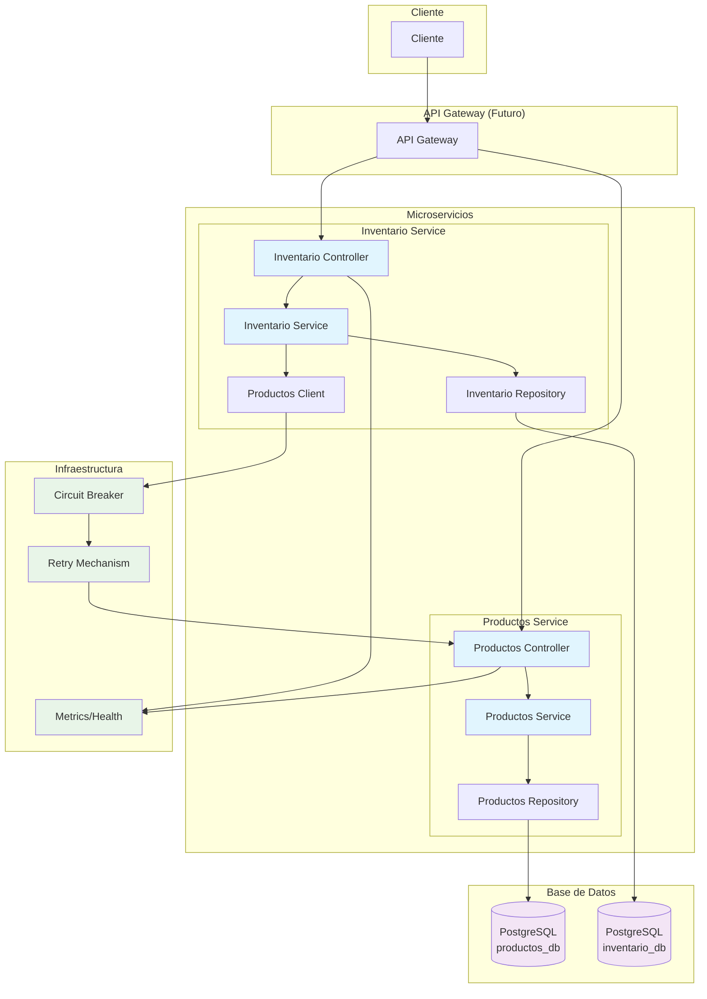

# 🛍️ Microservicios: Productos e Inventario

## 📋 Descripción

Solución compuesta por dos microservicios independientes que interactúan entre sí utilizando **JSON API** como estándar para la comunicación. Desarrollado como prueba técnica para demostrar habilidades en desarrollo backend con Spring Boot, siguiendo las mejores prácticas de arquitectura de microservicios.

### 🎯 Objetivos Cumplidos

- ✅ **Microservicio de Productos**: CRUD completo con paginación
- ✅ **Microservicio de Inventario**: Gestión de stock con integración
- ✅ **JSON API**: Estándar implementado en todas las respuestas
- ✅ **Docker**: Servicios completamente containerizados con Docker Compose
- ✅ **Autenticación**: API Keys para comunicación segura entre servicios
- ✅ **Tolerancia a fallos**: Resilience4j (Circuit Breaker, Retry, Timeout)
- ✅ **Pruebas**: Unitarias e integración con alta cobertura (+80%)
- ✅ **Documentación**: Swagger completa
- ✅ **Logs estructurados**: Sistema de logging con niveles configurables
- ✅ **Health Checks**: Monitoreo de salud de servicios y dependencias

## 🏗️ Arquitectura del Sistema

### Diagrama de Arquitectura




## 🔧 Decisiones Técnicas y Justificaciones

### 🗄️ Base de Datos: PostgreSQL

**Decisión**: Usar PostgreSQL como base de datos relacional.

**Justificación**:
- ✅ **Integridad referencial**: Relaciones claras entre productos e inventarios
- ✅ **Rendimiento**: Excelente para consultas complejas y agregaciones
- ✅ **Escalabilidad**: Soporte para particionado y replicación
- ✅ **Madurez**: Ecosistema robusto con Spring Data JPA


### 🛡️ Tolerancia a Fallos: Resilience4j

**Decisión**: Implementar Circuit Breaker, Retry y Timeout.

**Justificación**:
- ✅ **Circuit Breaker**: Previene cascada de fallos
- ✅ **Retry con backoff**: Maneja fallos transitorios de red
- ✅ **Timeout**: Evita bloqueos indefinidos
- ✅ **Métricas**: Observabilidad del estado de servicios externos

### 🔐 Seguridad: API Keys

**Decisión**: Autenticación mediante API Keys en headers.

**Justificación**:
- ✅ **Simplicidad**: Apropiado para comunicación entre servicios internos
- ✅ **Performance**: Sin overhead de tokens JWT o OAuth
- ✅ **Configurabilidad**: Fácil rotación via variables de entorno

### 🧪 Testing: Testcontainers + WireMock

**Decisión**: Pruebas de integración con containers reales.

**Justificación**:
- ✅ **Realismo**: Testcontainers usa PostgreSQL real
- ✅ **Aislamiento**: Cada test tiene su BD limpia
- ✅ **Mocking externo**: WireMock simula servicios externos
- ✅ **CI/CD Ready**: Funciona en pipelines automáticos

### 🐳 Containerización: Docker + Docker Compose

**Decisión**: Containerización completa con orquestación.

**Justificación**:
- ✅ **Portabilidad**: Funciona igual en dev, test y prod
- ✅ **Aislamiento**: Dependencias encapsuladas
- ✅ **Orquestación**: Docker Compose maneja servicios y red

## 📐 Patrones de Diseño Implementados

### 🎯 Domain-Driven Design (DDD)
- **Agregados**: Producto y Inventario como agregados independientes
- **Servicios de dominio**: Lógica de negocio encapsulada
- **Repositorios**: Abstracción de persistencia

### 🔌 Circuit Breaker Pattern
```java
@Component
public class ProductoClient {
    public ProductoDTO obtenerProducto(Long productoId) {
        return circuitBreakerFactory.create("productos-service").run(
            () -> llamarServicioProductos(productoId),
            throwable -> manejarFallo(productoId, throwable)
        );
    }
}
```

### 🔄 Retry Pattern
```yaml
resilience4j:
  retry:
    instances:
      productos-service:
        max-attempts: 3
        wait-duration: 1s
```

### 📡 Event Publishing Pattern
```java
@Component
@Slf4j
public class InventarioEventListener {
    ...
}
```

## 🚀 Instrucciones de Instalación y Ejecución

### Prerrequisitos

- **Docker** 20.10+ y **Docker Compose** 2.0+
- **Java 17+** (para desarrollo local)
- **Maven 3.8+** (para desarrollo local)
- **Git** (para clonar repositorio)

### 🚀 Inicio Rápido (Recomendado)

```bash
# Opción 1: Usar Makefile (recomendado)
make setup

make run

# Opción 2: Docker Compose directo
docker-compose up -d
```

### 3️⃣ Verificar Salud

```bash
# Verificar que todo funcione
make health-check

# Ver estado de servicios
make status
```

### 4️⃣ Cargar Datos de Prueba

```bash
make load-data
```

### 🛠️ Desarrollo Local

```bash
# Iniciar solo las bases de datos
docker-compose up -d postgres-productos postgres-inventario

# Ejecutar servicios localmente
cd productos-service
mvn spring-boot:run

# En otra terminal
cd inventario-service  
mvn spring-boot:run
```

### 🧪 Ejecutar Pruebas

```bash
# Todas las pruebas
mvn test

# Con reporte de cobertura
mvn clean test jacoco:report

# Solo pruebas de integración
mvn test -Dtest="*IntegrationTest"

# Ver reporte de cobertura
open target/site/jacoco/index.html
```


## 🌐 Documentación de API

### 📍 URLs de Acceso

| Servicio | URL Base | Swagger UI | Health Check |
|----------|----------|------------|--------------|
| **Productos** | http://localhost:8081 | [Swagger](http://localhost:8081/swagger-ui/index.html) | [Health](http://localhost:8081/actuator/health) |
| **Inventario** | http://localhost:8082 | [Swagger](http://localhost:8082/swagger-ui/index.html) | [Health](http://localhost:8082/actuator/health) |

### 🔑 Autenticación

Todos los endpoints requieren header de autenticación:
```
X-API-Key: secret-key
```

### 📡 Ejemplos de API

#### 🛍️ Productos Service

```bash
# Crear producto
curl -X POST http://localhost:8081/api/v1/productos \
  -H "Content-Type: application/json" \
  -H "X-API-Key: secret-key" \
  -d '{
    "data": {
      "nombre": "Laptop Gaming",
      "precio": 1299.99
    }
  }'

# Obtener producto
curl -H "X-API-Key: secret-key" \
  http://localhost:8081/api/v1/productos/1

# Listar productos con paginación
curl -H "X-API-Key: secret-key" \
  "http://localhost:8081/api/v1/productos?page=0&size=10&sort=nombre&direction=ASC"
```

#### 📦 Inventario Service

```bash
# Crear inventario para producto
curl -X POST http://localhost:8082/api/v1/inventarios/productos/1 \
  -H "Content-Type: application/json" \
  -H "X-API-Key: secret-key" \
  -d '{
    "data": {
      "cantidad": 50,
      "cantidadMinima": 10,
      "cantidadMaxima": 200
    }
  }'

# Consultar inventario (incluye datos del producto)
curl -H "X-API-Key: secret-key" \
  http://localhost:8082/api/v1/inventarios/productos/1

# Procesar compra
curl -X PATCH http://localhost:8082/api/v1/inventarios/productos/1/compra \
  -H "Content-Type: application/json" \
  -H "X-API-Key: secret-key" \
  -d '{
    "data": {
      "cantidad": 5
    }
  }'

# Ver inventarios con stock bajo
curl -H "X-API-Key: secret-key" \
  http://localhost:8082/api/v1/inventarios/stock-bajo
```

## 📊 Monitoreo y Observabilidad

### 🏥 Health Checks

Los servicios exponen múltiples health checks:

```bash
# Health general
curl http://localhost:8081/actuator/health

# Health detallado (requiere autorización)
curl -H "X-API-Key: secret-key" http://localhost:8081/actuator/health

# Health de circuit breakers
curl http://localhost:8082/actuator/health
```

## 📈 Propuestas de Mejoras y Escalabilidad

### 🔄 Mejoras Inmediatas

#### 1. **Event-Driven Architecture**
```java
// Reemplazar llamadas síncronas con eventos
@EventHandler
public void handle(ProductoCreatedEvent event) {
    inventarioService.crearInventarioInicial(event.getProductoId());
}
```

#### 2. **Cache Distribuido**
```java
@Cacheable(value = "productos", key = "#id")
public ProductoDTO obtenerProducto(Long id) {
    return productoRepository.findById(id);
}
```

## 🔧 Troubleshooting

### ❗ Problemas Comunes

#### 1. **Servicios no inician**
```bash
# Verificar logs
docker-compose logs inventario-service

# Verificar puertos
netstat -tulpn | grep :808

# Reiniciar limpio
docker-compose down -v
docker-compose up -d --build
```

#### 2. **Error de conexión entre servicios**
```bash
# Verificar network
docker network inspect linktic_default

# Verificar API keys
echo $PRODUCTOS_API_KEY

# Test manual de conectividad
docker-compose exec inventario-service curl productos-service:8081/actuator/health
```